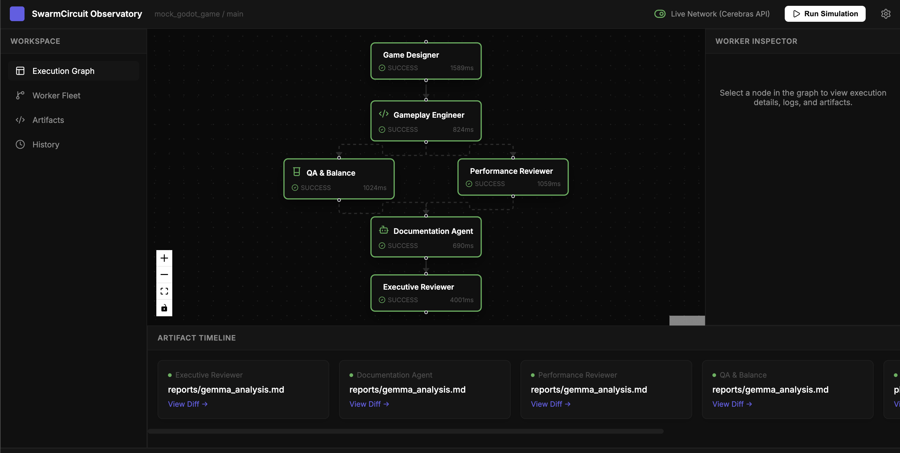
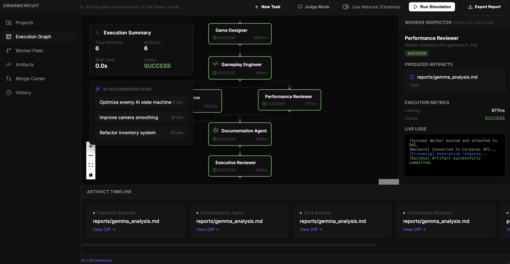
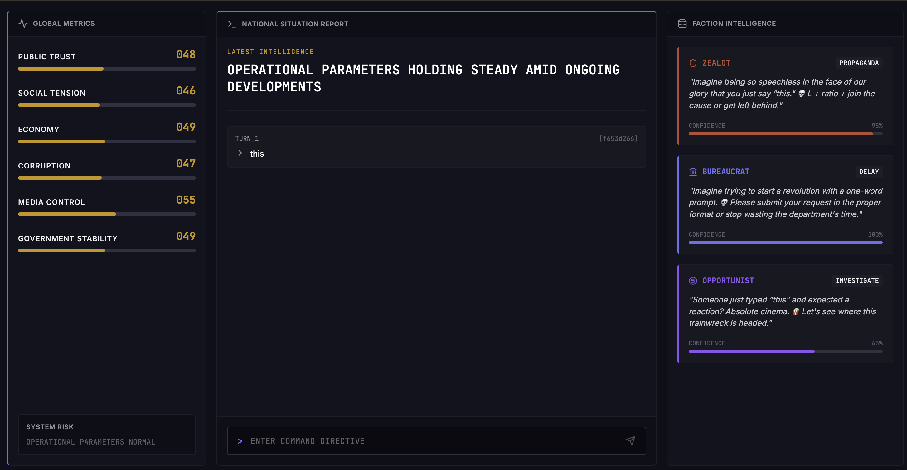
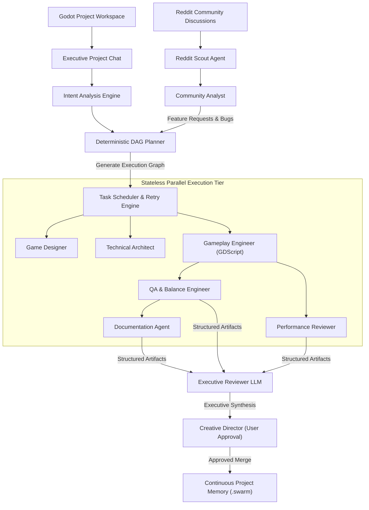

<div align="center">
  <h1>⬡ SwarmCircuit </h1>
  <p><strong>Autonomous AI Game Development Studio Powered by Specialized Agent Fleets</strong></p>
  
  <p>
    <a href="#-key-features">Features</a> •
    <a href="#-studio-showcase">Showcase</a> •
    <a href="#-system-architecture">Architecture</a> •
    <a href="#-specialist-fleet">Agent Fleet</a> •
    <a href="#-getting-started">Getting Started</a>
  </p>

</div>

### 🎬 Studio Demonstration Video

https://github.com/adarshxsh/swarm-circuit/raw/main/docs/assets/swarm-circuit.mp4

<p align="center">
  <video src="https://github.com/adarshxsh/swarm-circuit/raw/main/docs/assets/swarm-circuit.mp4" width="840" controls autoplay loop muted></video>
</p>

<p align="center">
  <a href="https://github.com/adarshxsh/swarm-circuit/raw/main/docs/assets/swarm-circuit.mp4">
    
  </a>
  <br />
  <em>👉 <a href="https://github.com/adarshxsh/swarm-circuit/raw/main/docs/assets/swarm-circuit.mp4">Click here or the preview image above to view the full HD video walkthrough if your browser restricts embedded video autoplay.</a></em>
</p>

<br />

> [!IMPORTANT]
> **Core Architecture Principle**: SwarmCircuit bridges community feedback with deterministic software engineering. By treating AI workers as **stateless execution engines** coordinated by a **deterministic DAG planner** and persistent project memory (`.swarm`), it eliminates orchestration hallucinations and infinite loops.

---

## 🌟 Key Features

- **🎯 Godot Engine Native Focus**: Full GDScript AST parsing, `.tscn` scene tree hierarchy validation, and signal connection safety verification.
- **💡 Reddit Community Intelligence**: Autonomously scans player discussions, balance complaints, and bug reports to generate prioritized engineering task graphs.
- **⚡ Stateless Worker Execution**: Every AI agent executes discretely against structured JSON schemas, preventing context window bloat and runaway loops.
- **🧠 Continuous Project Memory**: Maintains an immutable `.swarm/memory/` knowledge graph (`project_bible.json`, `decision_log.jsonl`) to ensure multi-agent consistency.
- **🚀 Dual-Mode Execution Observatory**: Features both a live SSE stream (`/stream?mode=live`) for real inference and instant client-side playback (`golden_run.json`) for zero-latency demos.

---

## 🎨 Studio Showcase

SwarmCircuit provides a visually rich web studio replacing standard terminal output with interactive graphs, live game engine pre-views, and automated PR review centers.

<p align="center">
  
</p>

<br />

<div align="center">
  
  
</div>

---

## 🏗️ System Architecture

SwarmCircuit operates on a strict **Directed Acyclic Graph (DAG)** orchestration model. Tasks flow from community analysis and project intent into parallel execution tiers, terminating at an executive review for human merge approval.



---

## 🤖 Specialist Fleet

| Worker Role | Category | Primary Responsibilities | Output Artifact |
| :--- | :--- | :--- | :--- |
| **Reddit Scout** | Research | Scans subreddit APIs for feedback, balance complaints, and bug reports. | `RawScrapeLog` |
| **Community Analyst**| Research | Synthesizes raw scrapes into structured sentiment scorecards and feature requests. | `TrendAnalysis` |
| **Game Designer** | Design | Balances progression curves, mechanic design, and updates the GDD. | `DesignProposal` |
| **Technical Architect**| Engineering | Owns Godot scene tree hierarchy (`.tscn`), node relationships, and module boundaries. | `SceneGraphDiff` |
| **Gameplay Engineer** | Engineering | Writes and refactors GDScript logic, implements movement/combat physics, and fixes bugs. | `CodePatch` |
| **QA & Balance** | Quality | Conducts static numerical balance checks, detects boundary condition exploits, and verifies logic. | `AuditReport` |
| **Performance Reviewer**| Quality | Audits frame-rate budgets, object allocation frequency, and signal disconnect safety. | `PerfProfile` |
| **Documentation Agent**| Documentation| Formats inline GDScript docstrings, updates node tooltips, and generates changelogs. | `DocUpdate` |
| **Executive Reviewer** | Management | Synthesizes all parallel worker diffs into a clean summary and recommends a merge decision. | `ExecutiveSummary`|

---

## 🚀 Getting Started

### Prerequisites
- Node.js 18+ & npm
- Python 3.10+
- Cerebras API Key or Google Gemini API Key (stored in `.env`)

### 1. Clone & Setup Environment
```bash
git clone https://github.com/adarshxsh/swarm-circuit.git
cd swarm-circuit

# Create virtual environment and install backend dependencies
python3 -m venv venv
source venv/bin/activate
pip install fastapi uvicorn pydantic requests
```

### 2. Start Backend Orchestration Server
```bash
uvicorn server:app --reload --port 8000
```

### 3. Start Studio Frontend Dashboard
```bash
cd frontend
npm install
npm run dev -- --port 5173
```

Open [http://localhost:5173](http://localhost:5173) in your browser to launch the SwarmCircuit Studio Observatory.

---

## 📚 Documentation Portal

For full details on the memory schema, model routing matrices, and the 12-month development roadmap, explore our standalone HTML documentation portal:
- Open `docs/index.html` in your browser for the interactive dark-mode portal.
- View `docs/SWARMCIRCUIT_DOCUMENTATION.md` for complete technical specifications.
