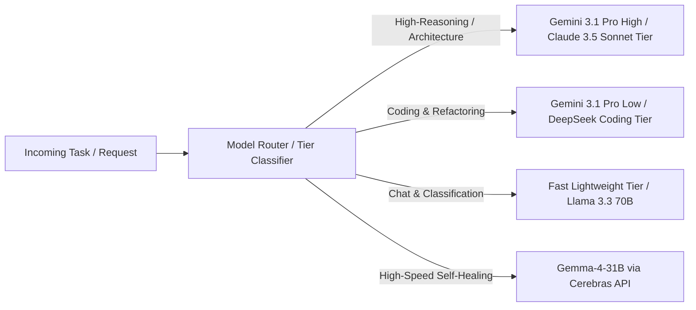

# SwarmCircuit v2 — Antigravity Pro Model Routing Matrix

## 1. Multi-Provider & Tier Strategy
SwarmCircuit leverages a configurable multi-model runtime. Rather than routing all queries through a single monolithic model, tasks are dispatched to specialized Antigravity Pro tiers based on reasoning requirements, latency constraints, context length, and cost efficiency.

---

## 2. Model Routing Assignment by Specialist Worker & Phase

| Worker / Role | Recommended Antigravity Model Profile | Optimal Characteristics | Why This Model is Assigned |
| :--- | :--- | :--- | :--- |
| **Project Chat (Mode 1)** | **Fast Lightweight Tier** *(e.g., Gemini 3.1 Flash / Llama 3.3 70B)* | Ultra-low latency (<500ms), high throughput, strong summarizing capability. | General chat requires immediate conversational responsiveness. Queries are mostly read-only summarization or lookups over curated project summaries. |
| **Deterministic Planner** | **High-Reasoning Tier** *(e.g., Gemini 3.1 Pro High)* | Deep spatial reasoning, strict adherence to structured JSON schema, graph dependency comprehension. | Constructing accurate multi-node DAGs requires deep understanding of system interdependencies to prevent execution deadlocks or missing prerequisites. |
| **System Architect** | **High-Reasoning Tier** *(e.g., Gemini 3.1 Pro High / Claude 3.5 Sonnet profile)* | Superior system design abstraction, long-context comprehension, API boundary definition. | Architecture proposals dictate long-term project stability. Requires highest reasoning capacity to evaluate trade-offs, scalability, and design patterns. |
| **Gameplay / Backend Engineer** | **Specialized Coding Tier** *(e.g., Gemini 3.1 Pro Low / DeepSeek Coder profile)* | High accuracy in syntax generation, AST manipulation, refactoring, test generation. | Optimized specifically for code generation across TypeScript, Python, C#, C++, and Rust. Delivers precise diffs without conversational bloat. |
| **QA Engineer** | **High-Reasoning / Adversarial Tier** *(e.g., DeepSeek Reasoner / Gemini 3.1 Pro High)* | Adversarial edge-case detection, vulnerability scanning, static logic checking. | QA requires breaking assumptions. Deep reasoning models excel at identifying race conditions, memory leaks, and boundary condition exploits. |
| **Performance Engineer** | **Specialized Coding Tier** *(e.g., Gemini 3.1 Pro Low)* | Algorithm profiling analysis, big-O optimization, memory layout understanding. | Focused on code efficiency, allocation reduction, and loop optimization. |
| **Research / Market Analyst** | **Fast Long-Context Tier** *(e.g., Gemini 3.1 Flash / Llama 3.3 70B)* | Massive context window, fast information extraction, web scraping synthesis. | Handles reading lengthy engine documentation, GitHub issue threads, and Reddit scrapes efficiently at low token cost. |
| **Documentation Engineer** | **Fast Lightweight Tier** *(e.g., Gemini 3.1 Flash)* | Clean technical prose, formatting precision, markdown syntax accuracy. | Formatting changelogs and updating API references requires consistent style without needing heavy reasoning models. |
| **Historian & Memory Keeper** | **Fast Long-Context Tier** *(e.g., Gemini 3.1 Flash)* | Structured data extraction, summarization, JSON pruning. | Condenses large workflow artifacts into concise Decision Log entries and updates the Knowledge Graph accurately. |
| **Executive Reviewer** | **High-Reasoning Tier** *(e.g., Gemini 3.1 Pro High)* | Nuanced judgment, multi-source synthesis, executive tone. | Acts as the final AI check before presenting to the Creative Director. Must weigh engineering trade-offs vs product goals accurately. |
| **Continuous Self-Healing** | **Gemma-4-31B (via Cerebras Ultra-Fast API)** | Extreme inference speed (1,000+ tokens/sec), open-weight inspectability, dedicated throughput. | Running continuous background scans across hundreds of files requires extreme speed and low marginal cost. Cerebras hardware acceleration makes continuous codebase auditing feasible. |

---

## 3. Development Roadmap Phase Model Assignments

### Phase 1: Core Foundation & Deterministic Orchestration MVP
- **Primary Model**: **Gemini 3.1 Pro High** (for building the core Planner AST, DAG Scheduler logic, and Artifact schema definitions).
- **Secondary Model**: **Gemini 3.1 Pro Low** (for writing boilerplate backend orchestration code, CLI tools, and file system handlers).

### Phase 2: Memory Layer & Context Engine Implementation
- **Primary Model**: **Gemini 3.1 Pro High** (for designing vector storage integration, AST symbol slicing algorithms, and Knowledge Graph schemas).
- **Secondary Model**: **Gemini 3.1 Flash** (for generating embedding pipelines and summary tokenizers).

### Phase 3: Specialist Worker Fleet & Plugin Ecosystem
- **Primary Model**: **Specialized Coding Tier** (for coding stateless worker wrappers, MCP plugin connectors for GitHub/Reddit/Unity).
- **Adversarial Testing**: **DeepSeek Reasoner profile** (to simulate edge cases in plugin failure recovery).

### Phase 4: Autonomous Self-Healing Engine Integration
- **Primary Model**: **Gemma-4-31B via Cerebras** (tuning prompt pipelines and background scanning loops for dead code and architectural drift detection).

### Phase 5: Studio Dashboard UI & Full System Polish
- **Frontend Development**: **Gemini 3.1 Pro Low / Claude 3.5 Sonnet profile** (for React/TypeScript/Vite dashboard design, glassmorphism UI, real-time timeline websocket connectors).
