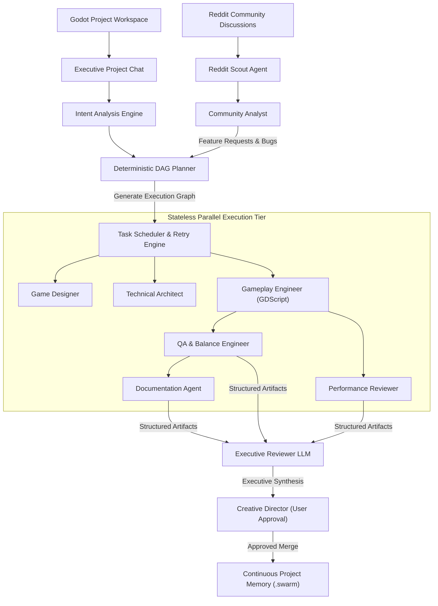
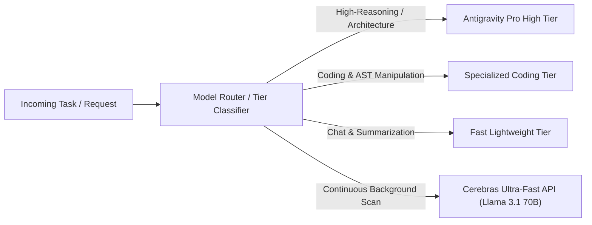
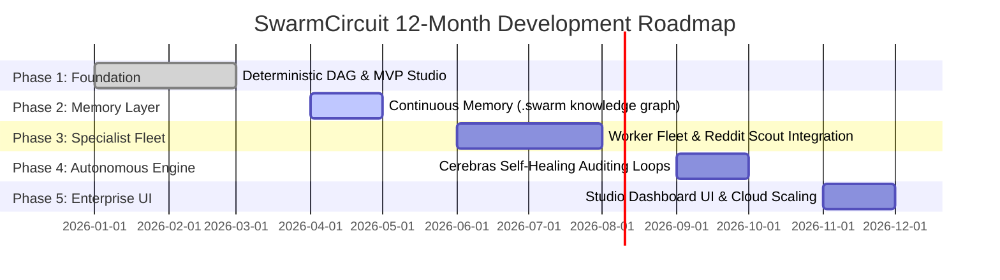

# SwarmCircuit v2 — Autonomous AI Game Development Studio
**Comprehensive Single-Page Technical Documentation & Architecture Reference**

> [!IMPORTANT]
> **Core Architecture Principle**: SwarmCircuit bridges community sentiment with deterministic software engineering. By treating AI workers as **stateless execution engines** coordinated by a **deterministic DAG planner** and persistent project memory, it eliminates orchestration hallucinations and infinite loops.

---

## Table of Contents
1. [Executive Summary & Product Vision](#1-executive-summary--product-vision)
2. [System Architecture & Workflow](#2-system-architecture--workflow)
3. [Specialist Worker Fleet](#3-specialist-worker-fleet)
4. [Antigravity Pro Model Routing Matrix](#4-antigravity-pro-model-routing-matrix)
5. [Continuous Project Memory Schema](#5-continuous-project-memory-schema)
6. [Hybrid Execution Observatory (Live vs. Demo)](#6-hybrid-execution-observatory-live-vs-demo)
7. [12-Month Development Roadmap (Phases 1–5)](#7-12-month-development-roadmap-phases-15)

---

## 1. Executive Summary & Product Vision

**SwarmCircuit** is an autonomous multi-agent game development platform where specialized AI workers collaborate to research, design, implement, review, and continuously improve game projects. Built specifically for independent studios and ambitious developers, it transforms raw community feedback into tested, production-ready code patches.

### Primary Focus
* **Target Engine**: Godot Engine 4.x (GDScript & `.tscn` scene tree support). *Unity & Unreal Engine support scheduled for Phase 4/5.*
* **Core Intelligence**: Reddit Community Intelligence — autonomously scanning player discussions, bug reports, and meta-trends to generate prioritized engineering tasks.
* **Key Invariants**: Project-first architecture, stateless AI execution, structured artifact handoffs, deterministic DAG scheduling, and human-in-the-loop merge approval.

---

## 2. System Architecture & Workflow

SwarmCircuit operates on a strict **Directed Acyclic Graph (DAG)** orchestration model. Tasks flow from intent analysis into parallel execution tiers, ending at an executive synthesis for human review.



### The Reddit-Centric Intelligence Loop
Instead of passive summaries, SwarmCircuit converts community discourse directly into engineering commits:
$$\text{Reddit Threads} \longrightarrow \text{Sentiment Synthesis} \longrightarrow \text{Trend Extraction} \longrightarrow \text{DAG Generation} \longrightarrow \text{Code Patches}$$

---

## 3. Specialist Worker Fleet

Every AI worker in SwarmCircuit is **100% stateless**. Workers receive a focused slice of context, execute their task using specialized inference profiles, produce a validated JSON/Markdown artifact, and terminate.

| Worker Role | Focus Area | Primary Responsibilities | Output Artifact |
| :--- | :--- | :--- | :--- |
| **Reddit Scout** | Community | Scans subreddit APIs for feedback, balance complaints, and bug reports. | `RawScrapeLog` |
| **Community Analyst**| Research | Synthesizes raw scrapes into structured sentiment scorecards and feature requests. | `TrendAnalysis` |
| **Game Designer** | Design | Balances progression curves, mechanic design, and updates the Game Design Document. | `DesignProposal` |
| **Technical Architect**| Architecture | Owns Godot scene tree hierarchy (`.tscn`), node relationships, and module boundaries. | `SceneGraphDiff` |
| **Gameplay Engineer** | Engineering | Writes and refactors GDScript logic, implements movement/combat physics, and fixes bugs. | `CodePatch` |
| **QA & Balance** | Quality | Conducts static numerical balance checks, detects boundary condition exploits, and verifies logic. | `AuditReport` |
| **Performance Reviewer**| Optimization | Audits frame-rate budgets, object allocation frequency, and signal disconnect safety. | `PerfProfile` |
| **Documentation Agent**| Documentation| Formats inline GDScript docstrings, updates node tooltips, and generates changelogs. | `DocUpdate` |
| **Executive Reviewer** | Management | Synthesizes all parallel worker diffs into a clean summary and recommends a merge decision. | `ExecutiveSummary`|

---

## 4. Antigravity Pro Model Routing Matrix

SwarmCircuit dynamically assigns different AI inference models to workers based on reasoning complexity, context requirements, and latency budgets.



### Routing Matrix
* **Antigravity Pro High Tier**: Assigned to *Deterministic Planner*, *Technical Architect*, and *Executive Reviewer*. Handles complex graph resolving, deep spatial reasoning, and architectural trade-offs.
* **Specialized Coding Tier**: Assigned to *Gameplay Engineer* and *Performance Reviewer*. Optimized for AST generation, precise git diffing, and zero-chatter code output.
* **Adversarial Tier**: Assigned to *QA & Balance Engineer*. Specialized in breaking assumptions, detecting race conditions, and vulnerability scanning.
* **Cerebras Ultra-Fast API**: Assigned to *Continuous Self-Healing Engine*. Delivers 1,000+ tokens/sec inference for continuous background auditing of project drift and dead code.

---

## 5. Continuous Project Memory Schema

To prevent hallucination across stateless runs, SwarmCircuit maintains an immutable, versioned memory root inside the project directory: `.swarm/memory/`.

```
.swarm/memory/
├── project_bible.json       # Core vision, creative direction, and technical invariants
├── architecture_graph.json  # Dependency trees and Godot node ownership
├── decision_log.jsonl       # Append-only ledger of accepted/rejected engineering decisions
├── technical_debt.json      # Tracked shortcuts, FIXME items, and refactoring backlogs
└── known_risks.json         # Security, performance, and memory bottleneck indices
```

### Worker Context Injection Payload
When executing a node, the scheduler extracts only the exact context required:
```json
{
  "taskId": "task_10492",
  "role": "GameplayEngineer",
  "objective": "Implement double jump physics in player.gd with coyote time.",
  "constraints": { "maxAllocationsPerFrame": "0 bytes", "targetFPS": 60 },
  "relevantFiles": [
    { "path": "res://scripts/player.gd", "contentSlice": "... [Lines 12-85] ..." }
  ],
  "upstreamArtifacts": [
    { "artifactType": "DesignProposal", "summary": "Coyote time set to 0.15s after platform departure." }
  ]
}
```

---

## 6. Hybrid Execution Observatory (Live vs. Demo)

The SwarmCircuit frontend studio supports dual-mode execution to accommodate both rapid prototyping and verified cloud inference:

> [!TIP]
> **Live Mode**: Streams real-time execution events from `server.py` over Server-Sent Events (`/stream?mode=live`). Workers trigger live LLM API calls and write actual diffs to the file system.

> [!NOTE]
> **Demo Mode**: Disconnects backend socket polling and reads from a pre-calculated cache (`golden_run.json`). Allows client-side instant playback, pausing, scrubbing, and fast-forwarding for presentations and debugging.

---

## 7. 12-Month Development Roadmap (Phases 1–5)



### Comprehensive Milestone Breakdown

#### Phase 1: Foundation & Deterministic Orchestration Core (Months 1–3)
* **Goal**: Establish deterministic orchestration (Planner + Scheduler), implement stateless worker lifecycles, and eliminate LLM chat orchestration loops.
* **Key Deliverables**: `swarm-orchestrator`, `swarm-scheduler` with exponential backoff retries ($2^n \times 1000\text{ms}$), SQLite/Postgres task database, and OpenTelemetry tracing.

#### Phase 2: Continuous Memory Layer & Context Engine (Months 4–5)
* **Goal**: Eliminate context window bloat by implementing AST-based file slicing and integrating persistent `.swarm/memory/` schemas.
* **Key Deliverables**: Tree-sitter code slicing engine, append-only `decision_log.jsonl`, local filesystem sandboxing with Docker container execution isolation.

#### Phase 3: Specialist Worker Fleet & Plugin Ecosystem (Months 6–8)
* **Goal**: Deploy all 9 specialized AI workers and enable integrations via Model Context Protocol (MCP) plugins.
* **Key Deliverables**: Full specialized fleet deployment, Reddit Scraper MCP, GitHub MCP, automated end-to-end repository simulation testing.

#### Phase 4: Autonomous Self-Healing Engine (Months 9–10)
* **Goal**: Launch background auditing loops that continuously scan and remediate codebase issues.
* **Key Deliverables**: `healing-daemon` powered by ultra-fast Cerebras inference (1,000+ tokens/sec), automated drift detection, dead code cleanup, and non-blocking PR generation.

#### Phase 5: Studio Dashboard UI & Enterprise Scalability (Months 11–12)
* **Goal**: Deliver a premium, visually rich Web Studio Dashboard replacing standard terminal output and scaling to enterprise multi-user repositories.
* **Key Deliverables**:
  * **Interactive Studio UI**: React / Vite / Vanilla CSS dashboard with real-time websocket timelines, interactive graph visualizations, and one-click PR Merge Center controls.
  * **Enterprise Storage & Collaboration**: Cloud artifact blob storage (S3), multi-user role-based access control (RBAC), and team workspace synchronization.
  * **Distributed Processing**: Scalable Celery/Redis distributed task queue handling parallel multi-agent executions across concurrent game projects.
